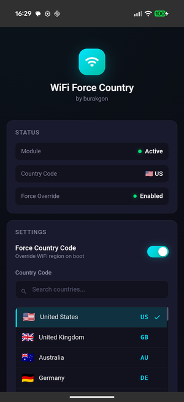

# WiFi Force Country Code — KernelSU Module

A KernelSU / Magisk module that forces your Android device's WiFi country code to any region, unlocking restricted channels and improving WiFi performance. Fully configurable through a built-in **WebUI** — no terminal needed.

<p align="center">
  
</p>

## Why?

Android locks WiFi channels based on your region. Some countries block 5 GHz channels, limit DFS bands, or reduce transmit power. This module overrides that restriction at boot, giving you access to all channels available in your chosen region.

**Common use cases:**
- Unlock 5 GHz channels (e.g. channels 100-144) blocked in your region
- Access DFS channels for less congested WiFi
- Match your router's country code for better compatibility
- Travel between regions without WiFi limitations

## Features

- **140 country codes** — Every code from the official Linux wireless-regdb
- **WebUI configuration** — Search, select, and apply from KernelSU Manager
- **Live status panel** — See current module state, active country code, and override status
- **WiFi auto-restart** — Optionally toggles WiFi off/on after applying so changes take effect immediately
- **Operation log** — Real-time step-by-step log of every action after applying
- **Persistent config** — Settings survive reboots, applied automatically at boot
- **Lightweight** — No background processes, no daemons, just a single boot-time command

## Installation

1. Download the latest release ZIP from [Releases](../../releases)
2. Open **KernelSU Manager** (or Magisk Manager)
3. Go to **Modules** → **Install from storage**
4. Select the downloaded ZIP
5. Reboot

## Configuration

1. Open **KernelSU Manager**
2. Go to **Modules** → **WiFi Force Country Code**
3. Tap the **settings icon** to open the WebUI
4. Select your desired country code
5. Toggle **Force Country Code** on/off
6. Check **Restart WiFi after applying** if you want immediate effect
7. Tap **Save & Apply**

## How It Works

On every boot, the module runs a single command after the system is ready:

```
cmd wifi force-country-code enabled <COUNTRY_CODE>
```

The country code and enabled state are read from a config file (`country.conf`) that the WebUI manages. That's it — no system files are modified, no partitions are touched.

## Supported Country Codes

| Code | Country | Code | Country | Code | Country |
|------|---------|------|---------|------|---------|
| US | United States | JP | Japan | SE | Sweden |
| GB | United Kingdom | KR | South Korea | NO | Norway |
| AU | Australia | CN | China | FI | Finland |
| DE | Germany | IN | India | CH | Switzerland |
| FR | France | BR | Brazil | NZ | New Zealand |
| CA | Canada | IT | Italy | SG | Singapore |
| ES | Spain | NL | Netherlands | TW | Taiwan |
| TR | Turkey | PL | Poland | HK | Hong Kong |

...and 25+ more available in the WebUI.

## Requirements

- Android 11+
- KernelSU or Magisk v20.4+
- WiFi hardware that supports the `cmd wifi` interface

## Troubleshooting

**Country code doesn't apply:**
- Make sure the module is enabled in KernelSU/Magisk Manager
- Reboot after installing
- Check the operation log in the WebUI for errors

**WiFi won't reconnect after applying:**
- Manually toggle WiFi from Android settings
- Some devices need a few seconds to reconnect

**WebUI not showing:**
- WebUI requires KernelSU Manager — Magisk users need to configure via editing `country.conf` manually

## License

MIT
